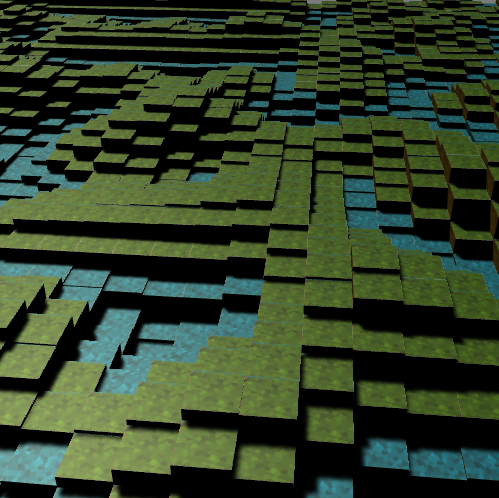
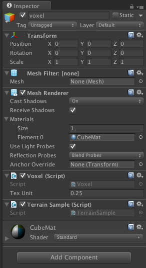

## SimpleVoxel
SimpleVoxel is using pseudo instancing technique to work on old mobile or old divices which is not suported instancing. There is this sort of class at asset store or git but I wanted create simple one and easy to modify code to any projects. If you know very fundamental matrix, vector and geometry pipeline, you can easily modify.

How to set up:
1. Create empty GameObject in your scene.
2. Add MeshFilter and MeshRenderer.
3. If you want to use vertex color, please add "ColorMat" to MeshRenderer. or If you want to use texture, please add "CubeMat" to MeshRenderer.
4. Add Voxel.cs script.
5. Add your script to manage voxel.

Applying textures to voxel:
you can add texture to top face and all around other faces. It's like Minecraft block look.
And you can also wrap same texture to all of faces.

Temporarily I've added 512x512 texture but you can edit whatever you want.
If you want "NxN" block texture, you have to adjust texture and "TexUnit" variable at "Voxel.cs".
"TexUnit" variable is equal to "(how many block texture you want) / 1".

In Voxel scene, you'll see how you can manage and control blocks.
In Terrain scene, this is verry simple terrain example.

Importantlty, I haven't added collider. If you want collider, you need to add collider by yourself.

System Requirements:
Unity 5.3 or later versions.
I only tested 5.3 one.

License:
Copyright (C) 2017 Yasuo Hasegawa

Permission is hereby granted, free of charge, to any person obtaining a copy of this software and associated documentation files (the "Software"), to deal in the Software without restriction, including without limitation the rights to use, copy, modify, merge, publish, distribute, sublicense, and/or sell copies of the Software, and to permit persons to whom the Software is furnished to do so, subject to the following conditions:

The above copyright notice and this permission notice shall be included in all copies or substantial portions of the Software.

THE SOFTWARE IS PROVIDED "AS IS", WITHOUT WARRANTY OF ANY KIND, EXPRESS OR IMPLIED, INCLUDING BUT NOT LIMITED TO THE WARRANTIES OF MERCHANTABILITY, FITNESS FOR A PARTICULAR PURPOSE AND NONINFRINGEMENT. IN NO EVENT SHALL THE AUTHORS OR COPYRIGHT HOLDERS BE LIABLE FOR ANY CLAIM, DAMAGES OR OTHER LIABILITY, WHETHER IN AN ACTION OF CONTRACT, TORT OR OTHERWISE, ARISING FROM, OUT OF OR IN CONNECTION WITH THE SOFTWARE OR THE USE OR OTHER DEALINGS IN THE SOFTWARE.
